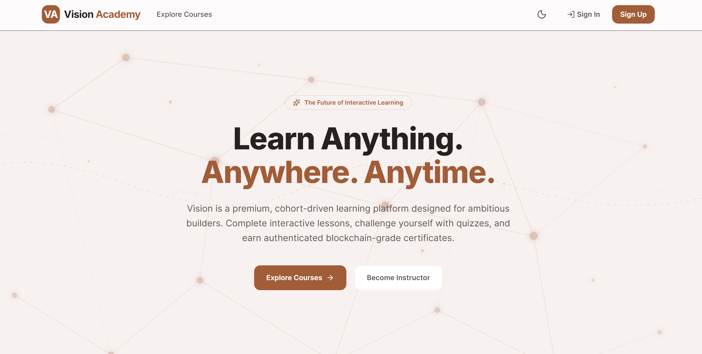
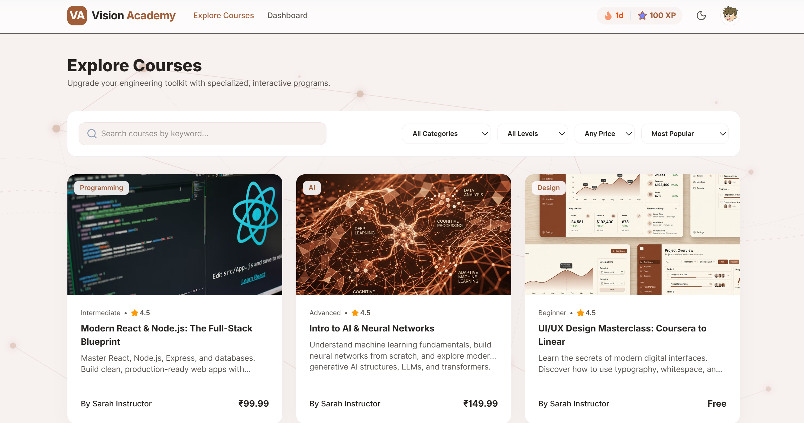
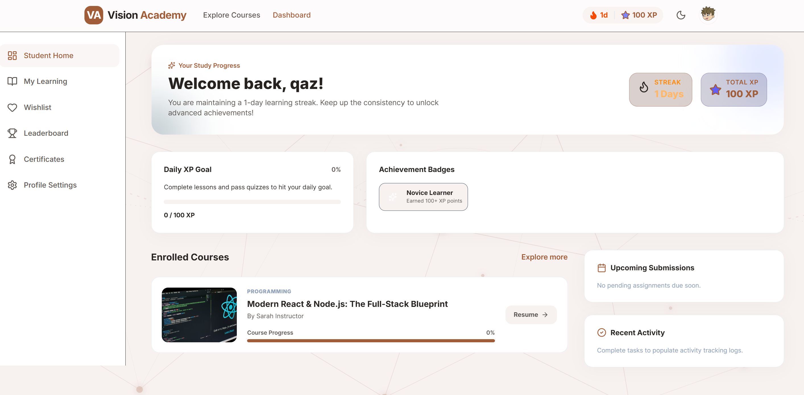
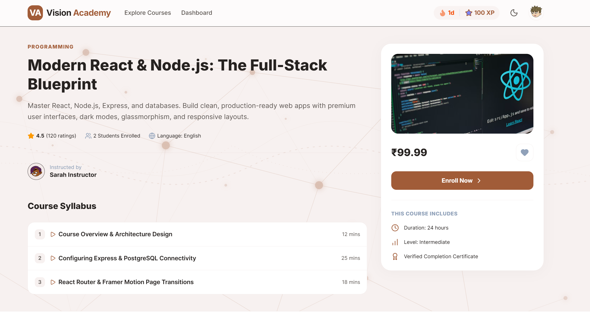
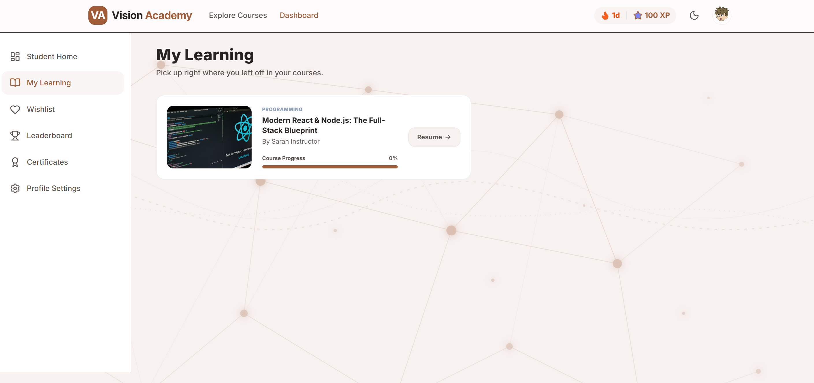
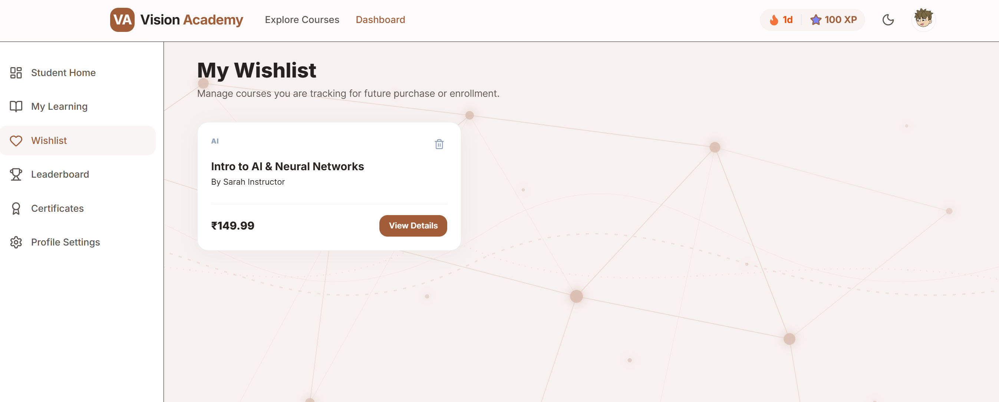
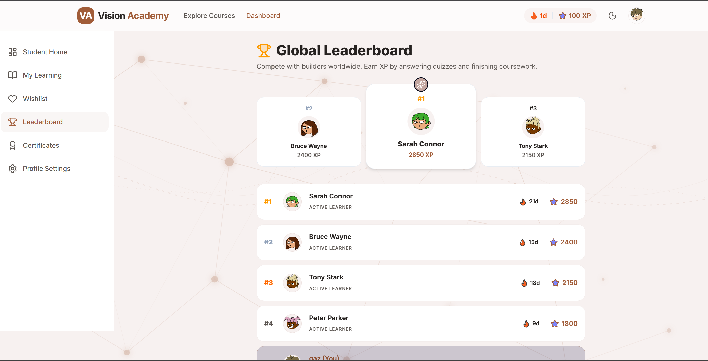
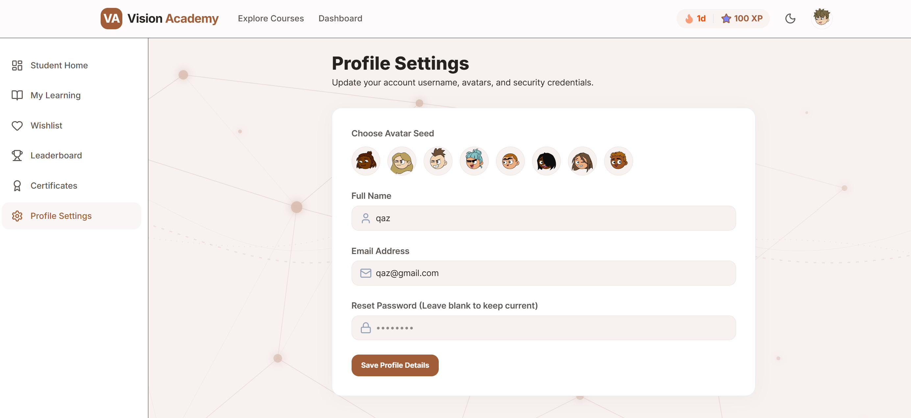

# 🎓 Vision Academy – Modern Learning Management System (LMS)

Vision Academy is a modern Learning Management System (LMS) built to provide an engaging and interactive online learning experience. The platform enables students to explore courses, enroll in programs, monitor their learning progress, earn achievements, and compete with others through a gamified learning environment.

Designed with a clean and responsive interface, Vision Academy combines intuitive user experience with modern web technologies to create a scalable educational platform.

---

## ✨ Features

### 🔐 Authentication
- Secure user registration and login
- Protected user dashboard
- Persistent authentication using Firebase

### 📚 Course Management
- Browse available courses
- Search courses by keyword
- Filter courses by category, level, price, and popularity
- View detailed course information
- Enroll in courses
- Wishlist support

### 👨‍🎓 Student Dashboard
- Personalized dashboard
- Daily learning streak tracking
- XP (Experience Points) system
- Achievement badges
- Daily XP goals
- Course progress tracking
- Recent learning activity
- Upcoming submissions overview

### 📖 Learning Management
- Resume enrolled courses
- Track course completion progress
- Organized "My Learning" section

### 🏆 Gamification
- XP reward system
- Daily learning streaks
- Achievement badges
- Global leaderboard
- Student rankings

### ❤️ Wishlist
- Save courses for future enrollment
- Remove courses from wishlist

### 👤 Profile Management
- Update profile information
- Avatar selection
- Change password
- Account settings

### 🌙 User Experience
- Responsive design
- Light & Dark mode support
- Smooth animations
- Modern UI components

---

# 🛠️ Tech Stack

## Frontend
- React.js
- Vite
- JavaScript (ES6+)
- HTML5
- CSS3

## Backend & Database
- Firebase Authentication
- Cloud Firestore Database

## State Management
- React Context API

## Routing
- React Router DOM

## Development Tools
- Git
- GitHub
- npm

---

# 🚀 Installation

## Clone the Repository

```bash
git clone https://github.com/YOUR_USERNAME/vision-academy-lms.git
```

## Navigate to the Project

```bash
cd vision-academy-lms
```

## Install Dependencies

```bash
npm install
```

## Start Development Server

```bash
npm run dev
```

The application will be available at:

```
http://localhost:5173
```


# 📸 Screenshots

## Landing Page



---

## Explore Courses



---

## Student Dashboard



---

## Course Details



---

## My Learning



---

## Wishlist



---

## Global Leaderboard



---

## Profile Settings



---

# 🚀 Future Enhancements

- Instructor Dashboard
- Course Creation Portal
- Video Lesson Support
- Quiz & Assignment Module
- Progress Certificates (PDF)
- Payment Gateway Integration
- Discussion Forums
- Notifications & Reminders
- Admin Dashboard
- Course Reviews & Ratings

---

# 👩‍💻 Author

**Khushi Rathore**

- GitHub: https://github.com/KR-23

---

